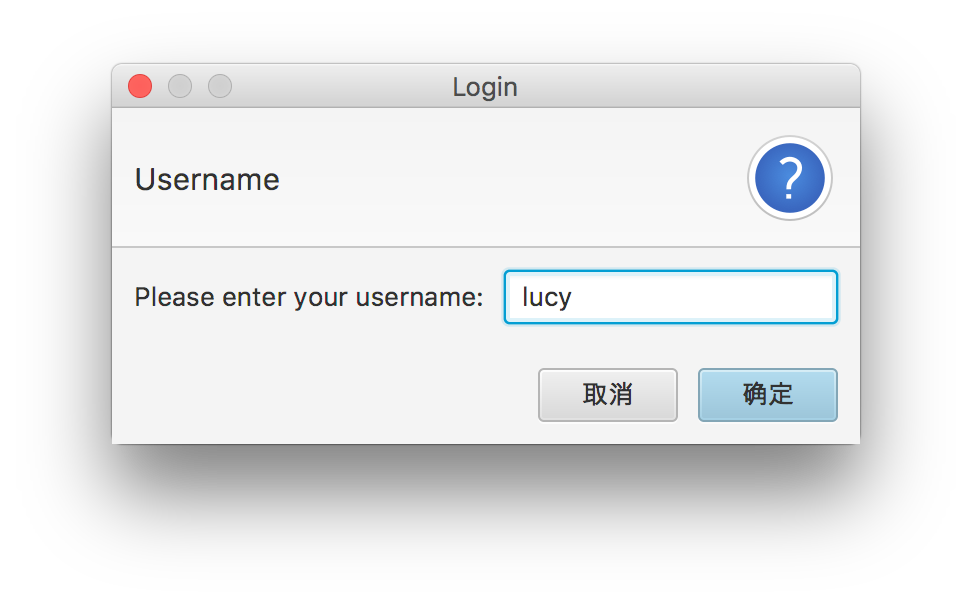
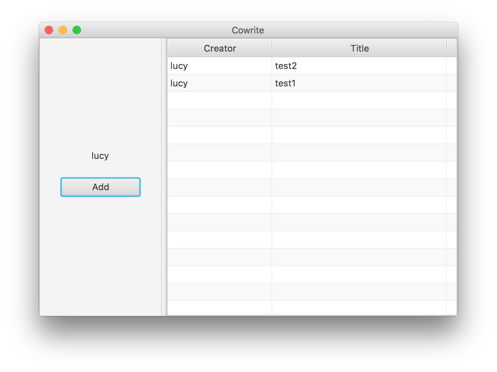
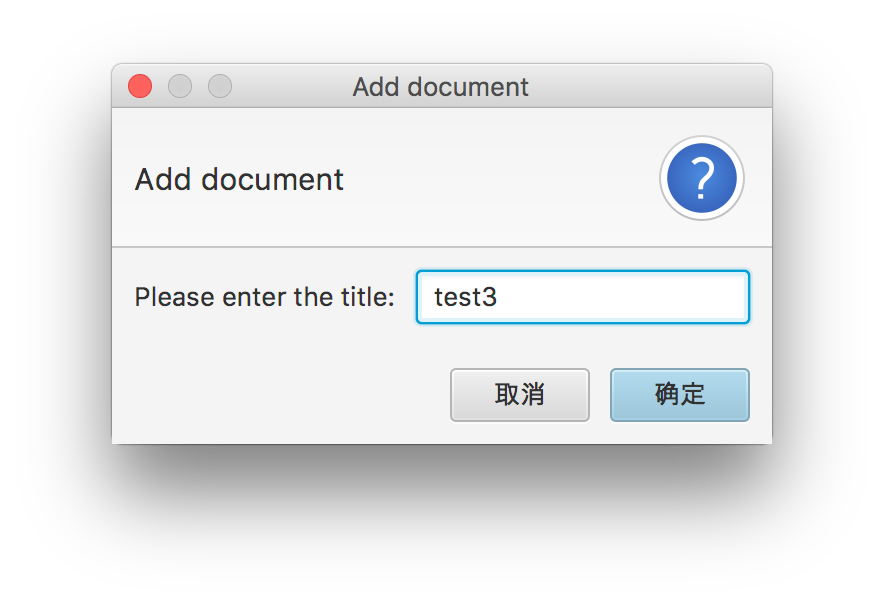
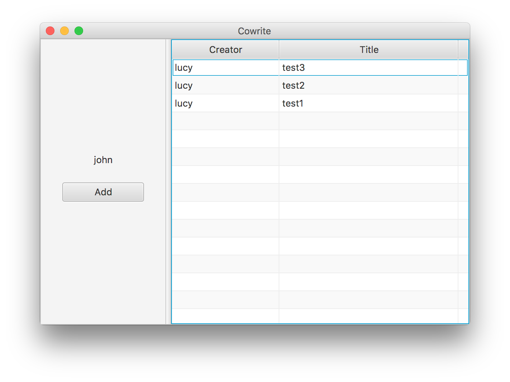
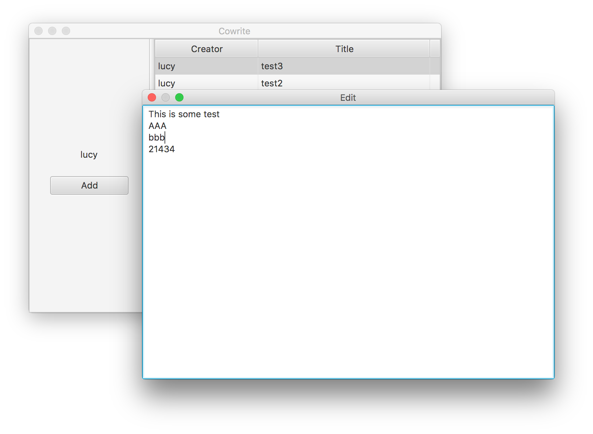
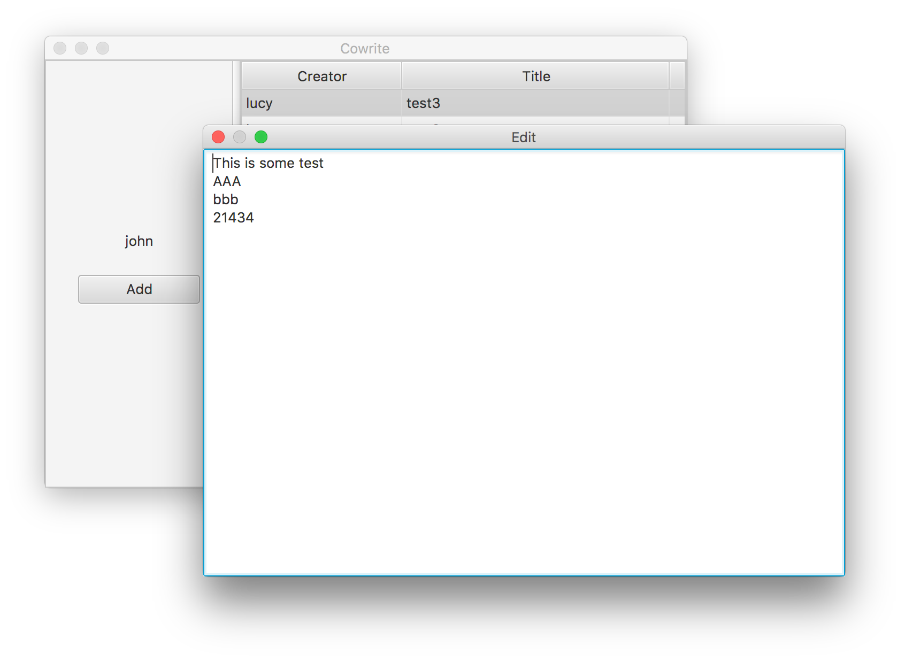

# Java应用技术实验报告

3150104785 郝广博 计算机科学与技术

## 引言

这个项目实现了一个最简单的多人同时写作的应用。支持多个用户同时编辑同一份文档。

## 总体设计

程序一共由三部分构成：`server`、`client`、`proto`。其中，`server`和`client`分别是服务端和客户端，`proto`中是一些数据模型，为`server`和`client`共享。

`server`和`client`通过socket进行通信，利用了Java的`Serializable`接口和`ObjectInputStream`/`ObjectOutputStream`，将对象序列化后进行传输，再在另一端反序列化得到对象。

app/Main.java是客户端程序的入口点，server/Main.java是服务端程序的入口点。

## 详细设计

### 模型定义

为了进行客户端和服务端的通信，这里定义了一些模型，在proto文件夹下：

```java
public class SocketDataBase implements Serializable {
    String meta;
    public String getMeta(){
        return meta;
    }
}
public class SocketData<T> extends SocketDataBase {
    private T data;

    private SocketData(){}

    public SocketData(String meta, T data){
        this.meta=meta;
        this.data=data;
    }

    public T getData(){
        return data;
    }
}
```

`SocketData`这个泛型类是用来包裹数据进行socket通信的。具体的socket通信实现下面会介绍到，这里就不再阐述了。

```java
public class Login implements Serializable {
    private String username;
    private String password;
    //...
}
```

`Login`是用户进行登录时填写的表单数据。

```java
public class User implements Serializable {
    private int id;
    private String username;
    private String password;
    //...
}
```

`User`是用户模型。

```java
public class Document implements Serializable {
    private int id;
    private static int nextId=0;
    private User creator;
    private String title;
    private String content;
    public Document(User creator, String title){
        this.id=nextId;
        nextId++;
        this.creator=creator;
        this.title=title;
    }
    //...
}
```

`Document`是文档模型，其中的静态属性`nextId`用来记录下一个实例应该分配给的id，在构造函数中会对其进行加一的操作。

### socket通信

客户端和服务端进行socket通信时，主要包括以下几个步骤：（以服务端向客户端发送数据为例）

1. 服务端将要发送的数据包裹成一个`SocketData`
2. 通过`ObjectOutputStream.writeObject()`将其序列化后发给客户端
3. 客户端接收数据，将其反序列化后得到一个Object
4. 将这个对象强制Down Cast为`SocketDataBase`，然后根据其`meta`属性，进行不同的处理操作

通过`SocketData`和`SocketDataBase`的继承，可以使得在不知道`SocketData<T>`中T的类型的情况下，就得到其`meta`属性，从而可以根据`meta`逻辑推出T的类型，再进一步进行Down Cast。

除此以外，由于IO是阻塞的，需要把socket独立为一个线程。在服务端，每一个socket连接都是一个`Handler`线程，由`new Handler(listener.accept()).start()`创建。在客户端，进行socket通信也是一个独立于GUI的线程，并且由单例的`SocketClient`进行管理。

### SocketClient单例模式的实现

把它的构造函数设置为private的，然后外部想要获取`SocketClient`实例的时候，通过`getSocketClient()`方法获取类内的`socketClient`静态属性：

```java
private static SocketClient socketClient = null;
public static SocketClient getSocketClient(){
    if(socketClient==null){
        socketClient = new SocketClient();
    }
    return socketClient;
}
```

### GUI实现

GUI通过JavaFX实现。通过fxml和scene builder工具可以实现页面布局的编写，通过每一个view对应的controller类可以实现对JavaFX组件的控制。

创建一个stage：

```java
public void start(Stage primaryStage) throws Exception{
    FXMLLoader loader = new FXMLLoader();
    loader.setLocation(Main.class.getResource("../view/Home.fxml"));
    Parent root = loader.load();
    primaryStage.setTitle("Cowrite");
    primaryStage.setScene(new Scene(root, 600, 400));
    primaryStage.show();
    this.stage =primaryStage;
    loader.setLocation(getClass().getResource("../view/Home.fxml"));
    HomeController controller = loader.getController();
    SocketClient.getSocketClient().setHomeController(controller);
    controller.setMainApp(this);
}
```

在controller中获得FXML中的控件：

```java
@FXML
private Button addDocumentButton;
```

相应按钮的点击事件及创建对话框：

```java
@FXML
private void addDocumentButtonClicked(){
    TextInputDialog dialog;
    Optional<String> result;
    dialog = new TextInputDialog("");
    dialog.setTitle("Login");
    dialog.setHeaderText("Username");
    dialog.setContentText("Please enter your username:");
    result = dialog.showAndWait();
    if (result.isPresent()){
        SocketClient.getSocketClient().addDocument(result.get());
    }
}
```

一共有Home和Doc两个页面：Home是首页，显示用户的信息和文档列表。Doc是文档编辑页面，是一个文本输入框。

不过，由于GUI和socket是两个线程，因此如果想在socket线程中对view层进行操作，需要通过`Platform.runLater(()->...)`实现。

### 登录

1. 用户点击登录按钮，controller中创建对话框，用户填写用户名和密码

2. 调用`SocketClient.login()`方法发送登录请求

   ```java
   public void login(String username, String password) {
       try {
           outputStream.writeObject(new SocketData<>(
                   "login",
                   new Login(username, password)
           ));
       }catch (IOException e){
           e.printStackTrace();
       }
   }
   ```

3. 服务端收到请求后进行验证，如果验证通过，将`user`保存至当前的线程的`userForThisSocket`属性

   ```java
   private void handleLogin(Login login) throws IOException{
       User user = getUser(login.getUsername());
       if (user==null){
           return;
       }else{
           if(user.checkPassword(login.getPassword())){
               userForThisSocket=user;
               userToWriterMap.put(userForThisSocket,out);
               out.writeObject(new SocketData<>(
                       "updateUser",
                       user
               ));
               updateDocuments();
           }
       }
   }
   ```

4. 登录成功后，会由服务端向客户端发送一个`meta`为`updateUser`的`SocketData`

5. 客户端更新view

### 文档列表

文档列表的展现是通过JavaFX的`TableView`实现的：

```java
@FXML
private TableView<DocumentRow> documentTable;
@FXML
private TableColumn<DocumentRow, String> creatorColumn;
@FXML
private TableColumn<DocumentRow, String> titleColumn;
```

通过`HomeController.updateDocumentList()`方法可以对其进行更新：

```java
public void updateDocumentList(ArrayList<Document> documents){
    documentRowList.clear();
    for (Document document: documents) {
        documentRowList.add(new DocumentRow(document.getId(), document.getCreator().getUsername(), document.getTitle()));
    }
}
```

### 创建文档

```java
@FXML
private void addDocumentButtonClicked(){
    TextInputDialog dialog;
    Optional<String> result;
    dialog = new TextInputDialog("");
    dialog.setTitle("Add document");
    dialog.setHeaderText("Add document");
    dialog.setContentText("Please enter the title:");
    result = dialog.showAndWait();
    if (result.isPresent()){
        SocketClient.getSocketClient().addDocument(result.get());
    }
}
```

在客户端，弹出对话框，由用户输入标题，然后发送请求创建文档。

在服务端，Document和User的列表都是分别存放在一个`HashSet`中的，当收到创建文档请求后，后端会实例化一个`Document`对象，并且把它插入到`documents`这个`HashSet`中：

```java
private void handleAddDocument(String title) throws IOException{
    documents.add(new Document(userForThisSocket,title));
    System.out.println(documents.size());
    updateDocuments();
}
```

### 修改文档

当用户要进入一个文档的编辑状态时，会首先创建出文档编辑窗口，然后调用`SocketClient.startDocumentEditing()`方法，发送请求让服务端记录下当前用户和这个文档对应的编辑关系：

```java
userToDocumentMap.put(userForThisSocket,document);
```

接下来，服务端会自动发送updateDocument数据包，让客户端加载文档的内容：

```java
out.writeObject(new SocketData<>(
        "updateDocument",
        document.getContent()
));
```

当一个用户修改文档的内容时，会自动发送到服务器：

```java
textProperty.addListener((observable, oldValue, newValue) -> {
    if(oldValue!=null&&newValue!=null&&!oldValue.equals(newValue)){
        SocketClient.getSocketClient().editDocument(newValue);
        System.out.println("TextField Text Changed (newValue: " + newValue + ")");
    }
});
```

然后该文档对应的其他正在编辑的用户会收到updateDocument通知，并且自动更新文档内容：

```java
private void handleUpdateDocument(SocketDataBase data){
    String content=((SocketData<String>)data).getData();
    Platform.runLater(()->{
        System.out.println("document update value:");
        System.out.println(content);
        docController.setText(content);
    });
}
```

当用户关闭文档编辑窗口时，会自动调用`SocketClient.stopDocumentEditing()`方法，通知后端将其从文档编辑用户的对应关系中删除：

```java
this.stage.setOnHiding(e->{
    SocketClient.getSocketClient().stopDocumentEditing();
});
```

## 测试和运行

#### 登录



#### 主界面



#### 创建文档



#### 创建文档后会自动更新两个客户端中的文档列表




#### 编辑文档



#### 修改会自动同步到另一个客户端中



## 总结

之前在做js开发的时候，由于js的单线程和IO异步特性，数据的收发都是通过回调函数或者Promise实现的，这次在做socket通信模块的时候，习惯性的以为Java中的IO也是异步的。通过独立的线程来实现IO，让我体会到了Java的美感，也对线程有了更深的理解。